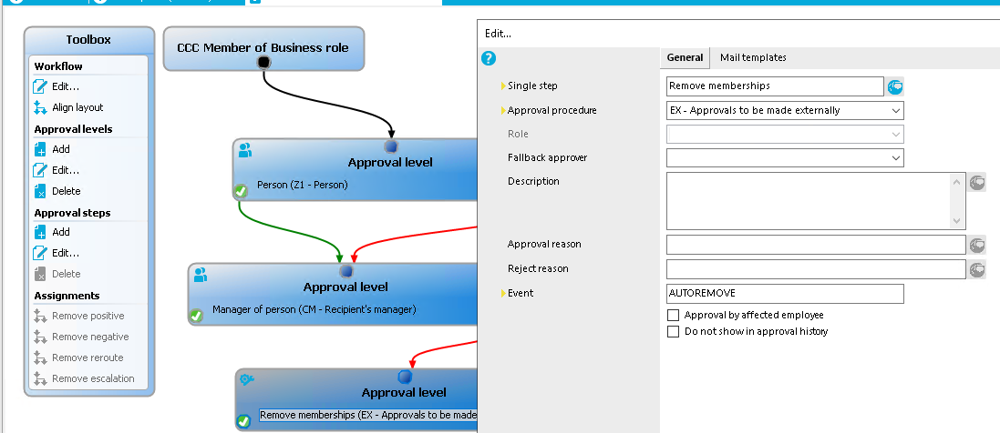

# Attestation. Troubleshooting

## Not working autoremove employee from Business roles and from Groups when denied attestation case

1. In QER\Attestation\AutoRemovalScope set scopes from employee will be remove
2. In Workflow policy need add additional step Ex with event AUTOREMOVE

[Identity Manager 8.1 - Attestation Administration Guide (oneidentity.com)](https://support.oneidentity.com/technical-documents/identity-manager/8.1/attestation-administration-guide/33#TOPIC-1129100)

- [Attestation. Troubleshooting](#attestation-troubleshooting)
  - [Not working autoremove employee from Business roles and from Groups when denied attestation case](#not-working-autoremove-employee-from-business-roles-and-from-groups-when-denied-attestation-case)
